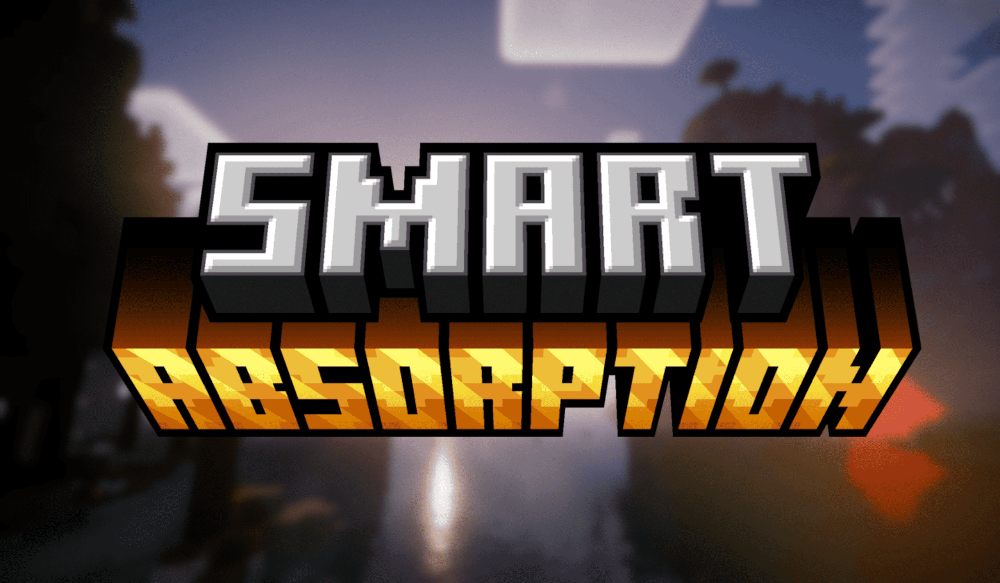

# Smart Absorption

**| [English](README.md) | >简体中文< |**

## 📑 介绍
在 Minecraft 中，当玩家同时拥有来自状态效果的伤害吸收量（以下简称**黄心**）和其他途径（如一些模组）提供的黄心时，所有黄心会混在一起计算。这会导致一个问题：

> **持有伤害吸收状态效果时，如果再通过其它途径获得更多黄心后，那个伤害吸收状态效果会一直等到所有黄心都消耗完才消失，在此期间无法再次获得伤害吸收状态效果。**

这个问题在原版 Minecraft 中并不明显，但将视线投入RPG类整合包中时，其亏损的黄心可能是致命的。

本模组通过隔离不同来源的黄心，完美解决了这个问题！

## 📌 主要功能
✅ **BUG修复**
- 修复**部分**版本中伤害吸收状态效果不会在黄心耗尽时移除的问题。

✅ **隔离不同来源的黄心**
- 来源包含**状态效果**和**其他方式**。
- 受伤时优先消耗来自状态效果的黄心。

✅ **较高兼容性**
- 非侵入性修改，应完美与多数模组兼容。

## 💭 FAQ
Q: 这个模组对原版机制的影响大吗？  
A: 没有，你甚至可能注意不到它的存在，因为修改后的机制反而更符合直觉。

Q: 支持哪些 Minecraft 版本？  
A: 主要维护 1.20.1，会继续更新其它版本，如果你有迫切的需求请提交issue。

Q: Forge/neoForge/Quilt 版本？  
A: 仅会支持 Fabric 但鼓励第三方移植。
